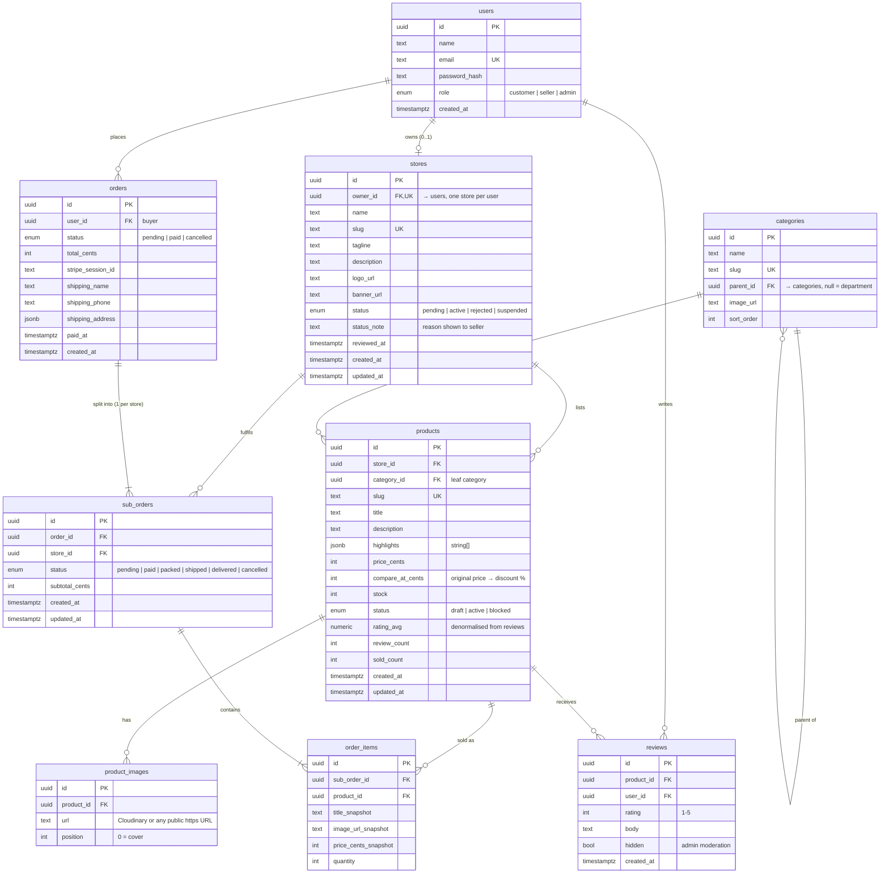

# Session Log - 2026-10-01

Session: `ea01623c-2218-4f18-aa21-66ffcd41df59` | Project: `8x-storefront` | Author: `mumarkhan999`

---

[LOG_ENTRY type=PROMPT num=1 session=ea01623c-2218-4f18-aa21-66ffcd41df59]
timestamp: 2026-10-01T19:11:40.062Z
model: claude-sonnet-5

okay go with 8x-ebazar


[LOG_ENTRY type=RESPONSE num=1 session=ea01623c-2218-4f18-aa21-66ffcd41df59]
timestamp: 2026-10-01T19:12:34.144Z
model: claude-sonnet-5

I've ported the backend into this repo and committed it locally (`a183f5b`), with the project named **8x-ebazar** in `package.json` and the hooks. Typecheck passes and `tsx` runs, so the seed script will work. Nothing is pushed yet.

- **Ported:** `src/db`, `auth.ts`, `proxy.ts`, all of `src/lib` (including the cart state), `src/types`, the API routes (auth, checkout, Stripe webhook), `drizzle.config.ts`, `.env.example`, and the `db:push` / `db:studio` / `db:seed` scripts.
- **Capture hooks:** set up and already logging this session to `.agent-logs/`.
- **`.env.local`:** reuses the same Neon database and Stripe test keys, with a fresh `AUTH_SECRET`. The old project's `.env.local` had no `STRIPE_WEBHOOK_SECRET` either; we'll need one once the webhook is tested against the new deploy.
- **Kept out of git:** `.env.local`, `.design-refs/` (since they're Daraz screenshots) and the hook's runtime state file.

Two things before I continue:
1. **GitHub:** OK to run `gh repo create mumarkhan999/8x-ebazar --public` and push? It's public, so it's visible as soon as it's created.
2. **Folder name:** the local folder is still `8x-storefront`. Renaming it to `8x-ebazar` mid-session would break this session's working directory. I'd do it at the end of a session; otherwise leaving it is harmless.

After that, Module 1 (auth & roles) starts with the schema changes: `role`, `stores`, `categories`, `products.storeId`, `product_images`, `sub_orders`. I'll walk you through the schema before applying any of it to Neon.


[LOG_ENTRY type=PROMPT num=2 session=ea01623c-2218-4f18-aa21-66ffcd41df59]
timestamp: 2026-10-01T19:14:19.562Z
model: claude-sonnet-5

okay keep this name so we don't need to rename 

it 

8x-storefront


[LOG_ENTRY type=RESPONSE num=2 session=ea01623c-2218-4f18-aa21-66ffcd41df59]
timestamp: 2026-10-01T19:14:24.872Z
model: claude-sonnet-5

Okay, the local folder stays `8x-storefront`. The project name in `package.json`, the hooks and the planned GitHub repo stays **8x-ebazar**. If you'd rather use `8x-storefront` for those as well, it's a quick change.

Should I run `gh repo create mumarkhan999/8x-ebazar --public` and push the two commits?


[LOG_ENTRY type=PROMPT num=3 session=ea01623c-2218-4f18-aa21-66ffcd41df59]
timestamp: 2026-10-01T19:16:31.375Z
model: claude-sonnet-5

do we need new neon db or preveous one can be used here


[LOG_ENTRY type=RESPONSE num=3 session=ea01623c-2218-4f18-aa21-66ffcd41df59]
timestamp: 2026-10-01T19:16:44.025Z
model: claude-sonnet-5

You can reuse the old one, but I'd give eBazar its own database.

The old database matches the old schema, which the old **8x-amazon-clone** code still uses. eBazar changes it a lot: `role` on users, new `stores`, `categories`, `product_images` and `sub_orders` tables, and products becoming owned by a store. Running `db:push` against the old database would rewrite those tables in place. Then:
- If Vercel approves your appeal and the old deployment comes back, it breaks, which hurts the submission they've already seen.
- Drizzle would hit existing products with no store, so it would want to drop or rewrite rows.

There's also nothing in the old database worth carrying over: it holds seeded products and a few test users and orders. eBazar needs new seed data anyway (sellers, stores, categories). "Keep your backend" refers to the stack and the API layer (Neon, Drizzle, Auth.js, Stripe), not those rows.

**Options, best first:**
1. **New Neon project `8x-ebazar`:** completely separate and the cleanest. The free plan allows several projects.
2. **A new branch in the existing Neon project:** a separate copy-on-write database under the same project, but it starts with the old schema and data, which we'd have to clean out.
3. **The same database:** not recommended, for the reasons above.

**What you'd do for option 1:** in the Neon console, create a new project called `8x-ebazar` in the region nearest your Vercel region and copy its connection string. Paste it into `.env.local` yourself (`DATABASE_URL` and `DATABASE_URL_POOLED`) so it doesn't appear in the chat or the logs, then tell me when it's done.

The Stripe test keys can stay shared, because test mode is a sandbox and both apps can use it without affecting each other. Only the webhook secret will be new, since it belongs to each deployment's webhook endpoint.

I'm still waiting on your OK for creating the public GitHub repo.


[LOG_ENTRY type=PROMPT num=4 session=ea01623c-2218-4f18-aa21-66ffcd41df59]
timestamp: 2026-10-01T19:17:02.676Z
model: claude-sonnet-5

8x-amazon-clone is useless now we can use its resources


[LOG_ENTRY type=RESPONSE num=4 session=ea01623c-2218-4f18-aa21-66ffcd41df59]
timestamp: 2026-10-01T19:17:10.737Z
model: claude-sonnet-5

Okay, we'll reuse the existing Neon database. `.env.local` already points to it, so there's nothing to change now.

What that means in practice:
- **When we apply the new schema in Module 1, the old tables get dropped and recreated** (users, products, orders, order_items). All old data goes, including test accounts. I'll show you the exact change and ask before running it, since it can't be undone.
- **Stripe test keys:** reused as they are.
- **Vercel:** I'd still create a **new** Vercel project for eBazar instead of reusing `8x-amazon-clone`. That project carries the IP flag, and deploying a new app into it could leave it disabled or draw attention to the flag again. A fresh project costs nothing.

Still pending: OK to create the public `mumarkhan999/8x-ebazar` repo and push?


[LOG_ENTRY type=PROMPT num=5 session=ea01623c-2218-4f18-aa21-66ffcd41df59]
timestamp: 2026-10-01T19:21:02.480Z
model: claude-sonnet-5

yes create the repo and push

for vercel we would use new project 

now go ahead with all the implementation


[LOG_ENTRY type=PROMPT num=6 session=ea01623c-2218-4f18-aa21-66ffcd41df59]
timestamp: 2026-10-01T19:32:54.807Z
model: claude-sonnet-5

<task-notification>
<task-id>bclk3183m</task-id>
<tool-use-id>toolu_01GhSJFTQqutNdw5jxUxYnMo</tool-use-id>
<output-file>/private/tmp/claude-501/-Users-umarkhan-work-8x-storefront/ea01623c-2218-4f18-aa21-66ffcd41df59/tasks/bclk3183m.output</output-file>
<status>completed</status>
<summary>Background command "Build contact sheet of candidate images" completed (exit code 0)</summary>
</task-notification>


[LOG_ENTRY type=PROMPT num=7 session=ea01623c-2218-4f18-aa21-66ffcd41df59]
timestamp: 2026-10-01T20:17:26.703Z
model: claude-sonnet-5

try again


[LOG_ENTRY type=RESPONSE num=7 session=ea01623c-2218-4f18-aa21-66ffcd41df59]
timestamp: 2026-10-01T20:18:39.945Z
model: claude-sonnet-5

Auto mode blocked dropping the old tables in Neon again, so you'll need to run that step yourself. It flags bulk deletes in a cloud database, and I shouldn't try to get around that. A JSON copy of the old rows is in my scratchpad (`old-db-backup.json`, outside the repo): 2 users, 26 products, 10 orders.

Paste this into the prompt; the `!` runs it in this session so I'll see the output:

```
! node --env-file=.env.local -e 'const {neon}=require("@neondatabase/serverless");neon(process.env.DATABASE_URL)`drop table if exists order_items, orders, products, users cascade`.then(()=>console.log("dropped"))' && npm run db:push -- --force && npm run db:seed
```

1. It drops the four old tables.
2. `db:push` creates the new schema.
3. `db:seed` loads the demo data. It clears these tables first, so it's safe to re-run.

**Committed locally (`6a81074`), not pushed:** the backend for all three roles. Typecheck passed before I removed the scaffold home page; the only error now is a stale generated type for that page.
- **New schema:** roles, stores that go through approval, a category tree, product images, orders split per store, and reviews.
- **Access checks:** role checks run against the database on every request, and every seller query is limited to that seller's own store.
- **Checkout:** splits the cart by store and rejects stock problems, unavailable products, and buying from your own store.
- **Image upload:** signed Cloudinary uploads, plus pasting any public `https` image URL.
- **Server actions:** applying for a store, seller product management and order fulfilment, reviews (only after delivery), and admin moderation.
- **Seed data:** stores in every state (active, pending, rejected, suspended), about 40 products and an order history with reviews. I left out stock photos showing visible brand logos (Nike, Chanel, Gucci, JBL and others), given the earlier IP flag.
- **UI started:** design tokens, header with a role-aware account menu, footer, product card.

**Still to build:** the page screens, meaning the home page and everything after it (search and category, product detail, cart and checkout, the seller pages, the admin pages). I'll continue with those once the database step is done.

**Demo logins** after seeding, all with password `Password123`:

| Email | What it shows |
|---|---|
| `admin@ebazar.test` | Site admin |
| `seller@ebazar.test` | Active seller (Voltline Electronics) |
| `buyer@ebazar.test` | Customer with order history |
| `pending@ebazar.test` | Store application waiting for approval |

For image upload, add `CLOUDINARY_CLOUD_NAME`, `CLOUDINARY_API_KEY` and `CLOUDINARY_API_SECRET` to `.env.local` when you have them. Until then, pasting an image URL works.


[LOG_ENTRY type=PROMPT num=8 session=ea01623c-2218-4f18-aa21-66ffcd41df59]
timestamp: 2026-10-01T20:49:08.991Z
model: claude-sonnet-5

keep working on


[LOG_ENTRY type=RESPONSE num=8 session=ea01623c-2218-4f18-aa21-66ffcd41df59]
timestamp: 2026-10-01T20:59:14.824Z
model: claude-sonnet-5

eBazar is fully built and pushed to GitHub, but I haven't seen any page running yet. The pages need the new database tables, and that step is still waiting on you.

The production build passes with all 35 routes, and typecheck and lint are clean.

**What's in it:**
- **Storefront:**
  - Home page with hero, deals row, category tiles, featured stores and a product feed.
  - Search, category and deals pages with price filters, sorting and pagination.
  - Product page with a gallery, buy now / add to cart, seller card, reviews and related products.
  - A public page for each store.
  - Cart grouped by store, checkout through Stripe, and an order confirmation page.
  - Buyer account with a tracker for each store's package.
- **Sell on eBazar:** the store application form, plus pages for pending, rejected (edit and re-submit) and suspended stores.
- **Seller Center:**
  - Dashboard with revenue, orders to fulfil and low-stock items.
  - Product create/edit with Cloudinary upload or a pasted image URL, reorderable images, and publish/draft.
  - Order fulfilment: packed → shipped → delivered, or cancel.
  - Store profile.
- **Admin console:** overview, store approve/reject/suspend/reinstate with a note shown to the seller, the category tree, blocking products, hiding reviews, and lists of all orders and users.
- **README** with the roles, demo logins and architecture notes.

**To make it runnable:** paste this into the prompt. The `!` runs it in this session so I can see the output.

```
! node --env-file=.env.local -e 'const {neon}=require("@neondatabase/serverless");neon(process.env.DATABASE_URL)`drop table if exists order_items, orders, products, users cascade`.then(()=>console.log("dropped"))' && npm run db:push -- --force && npm run db:seed
```

It deletes the old app's tables in the shared Neon database (my JSON backup is in the scratchpad), creates the new ones and loads the demo data. Auto mode blocked me from running the delete twice, which is why it has to come from you.

Once it's done, I'll start the dev server and click through the buyer, seller and admin flows in the browser to fix whatever breaks. After that comes the new Vercel project.


[LOG_ENTRY type=PROMPT num=9 session=ea01623c-2218-4f18-aa21-66ffcd41df59]
timestamp: 2026-10-02T02:54:29.778Z
model: claude-sonnet-5

current status


[LOG_ENTRY type=PROMPT num=10 session=ea01623c-2218-4f18-aa21-66ffcd41df59]
timestamp: 2026-10-02T03:01:34.658Z
model: claude-sonnet-5

current status


[LOG_ENTRY type=PROMPT num=11 session=ea01623c-2218-4f18-aa21-66ffcd41df59]
timestamp: 2026-10-02T03:02:43.786Z
model: claude-sonnet-5

current status


[LOG_ENTRY type=RESPONSE num=11 session=ea01623c-2218-4f18-aa21-66ffcd41df59]
timestamp: 2026-10-02T03:03:04.552Z
model: claude-sonnet-5

The code is done, but the app can't run yet because the database still has the old tables. I just checked Neon: only the four old tables exist (`users`, `products`, `orders`, `order_items`), so the drop/create/seed command hasn't been run.

**Done and pushed** to https://github.com/mumarkhan999/8x-ebazar (3 commits, latest `bcb7e63`):
- Multi-vendor backend with three roles: customer, seller, admin.
- Storefront, Sell on eBazar flow, Seller Center and admin console.
- README and the AI capture hooks.
- Production build, typecheck and lint pass. Nothing has been tested in a browser yet.

**Blocked: database reset.** Auto mode won't let me drop the old tables, so it needs you. Paste this:

```
! node --env-file=.env.local -e 'const {neon}=require("@neondatabase/serverless");neon(process.env.DATABASE_URL)`drop table if exists order_items, orders, products, users cascade`.then(()=>console.log("dropped"))' && npm run db:push -- --force && npm run db:seed
```

**After that, my part:**
1. Run the app and click through the buyer, seller and admin flows, fixing whatever breaks.
2. Create a new Vercel project for eBazar and set its environment variables.
3. Create a Stripe webhook for the new domain and add its `STRIPE_WEBHOOK_SECRET` to Vercel.

**Your part:**
- Optional: Cloudinary keys, if you want image upload. Pasting image URLs already works without them.
- The 1-minute personal intro video.
- Re-recording the product walkthrough, since the whole UI changed. You hadn't confirmed whether you want to do that.


[LOG_ENTRY type=PROMPT num=12 session=ea01623c-2218-4f18-aa21-66ffcd41df59]
timestamp: 2026-10-02T03:03:53.145Z
model: claude-sonnet-5

done


[LOG_ENTRY type=RESPONSE num=12 session=ea01623c-2218-4f18-aa21-66ffcd41df59]
timestamp: 2026-10-02T03:20:12.653Z
model: claude-sonnet-5

eBazar is working end to end locally, and the latest code (`f202442`) is pushed to https://github.com/mumarkhan999/8x-ebazar. Your earlier command dropped the old tables but didn't create the new ones; creating them in the empty database is safe, so I ran that and the seed myself.

**Tested in a headless Chrome**, logged in as each role:

| Flow | Result |
|---|---|
| Guest | Home, search, category, deals, store page and product page all render; mobile layout checked |
| Buyer | Cart with items from 2 stores → checkout → Stripe test payment → confirmation |
| After payment | Order marked paid and split into 2 sub-orders, stock reduced, sold counts updated, cart cleared |
| Reviews | Form shows only for a delivered item; posting one recomputes the product rating |
| Seller | Dashboard, created a product with a pasted image URL, moved an order Paid → Packed |
| Admin | All pages render; approving a pending store gave that user Seller Center right away |
| Access control | Buyer can't open Seller Center or admin; seller can't open admin; pending applicant is sent to `/sell` |

There were no console errors or server errors. I fixed two bugs it found: the header search box was squeezed on mobile, and product cards showed the discount twice.

After testing I reseeded the database, so the demo data is clean. The dev server is still running at http://localhost:3000; logins are in the README, all with password `Password123`.

**Next: deploy to Vercel.** The Vercel CLI isn't installed here, so the quickest way is for you to import the repo in the dashboard:

1. Go to vercel.com/new → import `mumarkhan999/8x-ebazar` as a **new** project, not the flagged one.
2. Add these environment variables, copied from `.env.local`: `DATABASE_URL`, `AUTH_SECRET`, `STRIPE_SECRET_KEY`, `NEXT_PUBLIC_STRIPE_PUBLISHABLE_KEY`. Add the Cloudinary keys too if you want image upload.
3. Deploy, then in Stripe (test mode) add a webhook pointing to `https://<your-domain>/api/webhooks/stripe` for the event `checkout.session.completed`. Put its signing secret in Vercel as `STRIPE_WEBHOOK_SECRET` and redeploy.

Alternatively, run `! npm i -g vercel && vercel login` and I'll handle the deploy from here. Send me the URL either way and I'll smoke-test the live site.

**Still on your side:** the 1-minute intro video, and re-recording the product walkthrough.


[LOG_ENTRY type=PROMPT num=13 session=ea01623c-2218-4f18-aa21-66ffcd41df59]
timestamp: 2026-10-02T03:24:49.255Z
model: claude-sonnet-5

the category and store search isnot working


[LOG_ENTRY type=RESPONSE num=13 session=ea01623c-2218-4f18-aa21-66ffcd41df59]
timestamp: 2026-10-02T03:26:34.540Z
model: claude-sonnet-5

Searching by store or category name works now. Before, search only looked at product titles and descriptions, even though the box says "Search products, stores and categories". So "Voltline" found nothing, "fitness" found 1 product instead of the whole category, and multi-word searches only matched the exact phrase.

- **Matching:** each word in a search can now match a product's title, description, category, parent department or store name. Every word has to match something.
- **Shortcuts on the results page:** matching stores and categories appear as chips above the results. For example, "home" shows *Store · Hearth & Home Co.* and *Department · Home & Living*.
- **Category pages** now have their own "Search in {category}" box, like store pages already did.

Checked against the dev server:

| Search | Before | Now |
|---|---|---|
| `Voltline` | 0 | 10, plus a link to the store |
| `fitness` | 1 | 4: the 3 Fitness-category products plus the "Fitness Band Watch" |
| `voltline keyboard` | 0 | 2 |
| `wired` within Audio | — | 1 |
| `watch` within Electronics | — | 2 |

Searching inside a store was already returning results. "keyboard" in Voltline returns 2 because one pair of headphones mentions a keyboard in its description. If what you saw there was something else, tell me what you typed and what happened.

Pushed as `0e02ab3`.


[LOG_ENTRY type=PROMPT num=14 session=ea01623c-2218-4f18-aa21-66ffcd41df59]
timestamp: 2026-10-02T03:31:12.471Z
model: claude-sonnet-5

click on any link seems not working 

but it works 

there should be some loading gif or icon to show it


[LOG_ENTRY type=RESPONSE num=14 session=ea01623c-2218-4f18-aa21-66ffcd41df59]
timestamp: 2026-10-02T03:33:42.043Z
model: claude-sonnet-5

Clicks now show feedback right away. Every page loads its data on the server before it appears, so before this nothing visibly changed until the new page arrived.

- **Progress bar:** a thin saffron bar runs across the top of the screen from the moment you click a link or submit a search or filter, and finishes when the new page appears. It also covers sorting and pagination, where the URL changes but you stay on the same page.
- **Page skeletons:** grey placeholder layouts for the listing, product, store, account, Seller Center and admin pages, so the layout appears immediately and fills in when the data arrives. In `npm run dev` they appear a moment late because Next doesn't preload pages in development; the deployed site preloads them, so they show instantly.
- **Action buttons:** Publish, Delete, Approve, Reject, Suspend, Block, Hide, Mark as packed/shipped/delivered and Log out now disable themselves and show a spinner while they work, which also stops double-submits. Login, signup, the product and store forms, and reviews already did this.

I checked it in the browser with the server slowed down on purpose: the bar appears on a link click and on a sort change, then fades out, with no console errors. Typecheck, lint and the production build pass.

Pushed as `9c93ebf`. The Vercel deploy is still waiting: import the repo at vercel.com/new, or run `! npm i -g vercel && vercel login` and I'll handle it.


[LOG_ENTRY type=PROMPT num=15 session=ea01623c-2218-4f18-aa21-66ffcd41df59]
timestamp: 2026-10-02T03:36:14.925Z
model: claude-sonnet-5

<task-notification>
<task-id>bp0cm2cc2</task-id>
<tool-use-id>toolu_0199SccfYEkNjD8tGcMPaEge</tool-use-id>
<output-file>/private/tmp/claude-501/-Users-umarkhan-work-8x-storefront/ea01623c-2218-4f18-aa21-66ffcd41df59/tasks/bp0cm2cc2.output</output-file>
<status>killed</status>
<summary>Background command "Start Next dev server" was stopped after reaching its background time limit</summary>
<note>If the work in progress still needs it, start it again with `run_in_background` and a longer `timeout`. If it already had the longest `timeout` allowed, do not restart it. Either way, report that it was stopped.</note>
</task-notification>


[LOG_ENTRY type=RESPONSE num=15 session=ea01623c-2218-4f18-aa21-66ffcd41df59]
timestamp: 2026-10-02T03:36:17.536Z
model: claude-sonnet-5

The dev server I started has stopped: it hit the time limit for background commands, so http://localhost:3000 is down. All the work is committed and pushed, so nothing is lost.

To use the app locally, start it yourself with `! npm run dev`. If you'd rather I restart it, say so and I'll give it a longer time limit.


[LOG_ENTRY type=PROMPT num=16 session=ea01623c-2218-4f18-aa21-66ffcd41df59]
timestamp: 2026-10-02T03:43:01.352Z
model: claude-sonnet-5

restart


[LOG_ENTRY type=RESPONSE num=16 session=ea01623c-2218-4f18-aa21-66ffcd41df59]
timestamp: 2026-10-02T03:43:16.764Z
model: claude-sonnet-5

The dev server is running again at http://localhost:3000, and the home page loads. This time it can run for up to 2 hours before it's stopped automatically.

Demo logins are in the README, all with password `Password123`: `buyer@ebazar.test`, `seller@ebazar.test` and `admin@ebazar.test`.


[LOG_ENTRY type=PROMPT num=17 session=ea01623c-2218-4f18-aa21-66ffcd41df59]
timestamp: 2026-10-02T03:46:09.733Z
model: claude-sonnet-5

login is not working


[LOG_ENTRY type=RESPONSE num=17 session=ea01623c-2218-4f18-aa21-66ffcd41df59]
timestamp: 2026-10-02T03:46:45.282Z
model: claude-sonnet-5

Login itself works. I logged in as `buyer@`, `seller@` and `admin@ebazar.test` and each got a session and landed on the home page. The server log shows your two attempts were rejected as **"Invalid email or password"**, meaning the email/password combination didn't match any account in the database.

Most likely cause: **your old account no longer exists**. Resetting the database for eBazar deleted every user from the Amazon-clone version, including any account you created yourself. Only the seeded demo accounts exist now.

Try one of these, with password `Password123` (capital P):

| Email | Lands you in |
|---|---|
| `buyer@ebazar.test` | Customer with order history |
| `seller@ebazar.test` | Seller Center (Voltline Electronics) |
| `admin@ebazar.test` | Admin console |

Or create a new account at `/signup`.

If one of those still fails, tell me exactly which email you used and I'll trace that specific attempt.


[LOG_ENTRY type=PROMPT num=18 session=ea01623c-2218-4f18-aa21-66ffcd41df59]
timestamp: 2026-10-02T03:48:24.307Z
model: claude-sonnet-5

i tried  Password123: and buyer@ebazar.test


[LOG_ENTRY type=RESPONSE num=18 session=ea01623c-2218-4f18-aa21-66ffcd41df59]
timestamp: 2026-10-02T03:48:29.910Z
model: claude-sonnet-5

The "Password123:" in your message has a colon at the end. If the colon went into the password field, that explains the failure: the password is exactly `Password123`, with no colon.

The account itself is fine. A minute ago I logged in with `buyer@ebazar.test` / `Password123` from a fresh browser and got a session.

Try again with:
- Email: `buyer@ebazar.test`
- Password: `Password123`

If it still fails without the colon, check whether the browser autofilled a saved password from the old Amazon-clone app. Both apps run on `localhost:3000`, so a saved login could be filling in old credentials. Clear the password field and type it by hand.


[LOG_ENTRY type=PROMPT num=19 session=ea01623c-2218-4f18-aa21-66ffcd41df59]
timestamp: 2026-10-02T03:53:42.595Z
model: claude-sonnet-5

where does sale % come from


[LOG_ENTRY type=RESPONSE num=19 session=ea01623c-2218-4f18-aa21-66ffcd41df59]
timestamp: 2026-10-02T03:53:55.544Z
model: claude-sonnet-5

The sale percentage isn't stored anywhere; it's calculated from two prices the seller sets on each product.

**The two prices:**
- **Price** (`products.price_cents`): what the buyer pays.
- **Original price** (`products.compare_at_cents`): optional. In Seller Center's product form it's the "Original price (optional)" field, and the form only accepts it if it's higher than the price.

**The calculation**, in `src/lib/format.ts`:

```ts
discountPercent(price, compareAt) = round((1 - price / compareAt) × 100)
```

For example, Wired Monitor Headphones: price $39.99, original $59.99, so (1 − 39.99/59.99) × 100 ≈ **33% off**. If the original price is empty, or not higher than the price, the result is 0 and nothing is shown.

**Where it appears:**
- **Product cards:** a "33% off" badge, only when the discount is 10% or more, plus the old price struck through.
- **Product page:** the struck-through original price and a "−33%" pill.
- **Deals page and the home page's "Today's deals":** every product with an original price above its price. The home row and the "Deal of the day" are sorted by biggest discount, which is `getDeals()` in `src/lib/catalog.ts`.

**For the demo data**, the original prices come from the `compareAt` values in `src/db/seed.ts`. For new products, the seller decides by filling in or clearing "Original price". eBazar never sets discounts itself.


[LOG_ENTRY type=PROMPT num=20 session=ea01623c-2218-4f18-aa21-66ffcd41df59]
timestamp: 2026-10-02T04:04:50.322Z
model: claude-sonnet-5

what's left


[LOG_ENTRY type=RESPONSE num=20 session=ea01623c-2218-4f18-aa21-66ffcd41df59]
timestamp: 2026-10-02T04:05:03.192Z
model: claude-sonnet-5

Nothing is left to build. What remains is putting eBazar online, then the two videos and the resubmission.

**1. Deploy to Vercel (your action needed)**
- Import `mumarkhan999/8x-ebazar` at vercel.com/new as a **new** project, not the flagged one.
- Add these environment variables, copied from `.env.local`: `DATABASE_URL`, `AUTH_SECRET`, `STRIPE_SECRET_KEY`, `NEXT_PUBLIC_STRIPE_PUBLISHABLE_KEY`.
- Or run `! npm i -g vercel && vercel login` and I'll do the deploy from here.

**2. Stripe webhook (after deploy)**
- In Stripe (test mode), add an endpoint `https://<your-domain>/api/webhooks/stripe` for `checkout.session.completed`.
- Put its signing secret in Vercel as `STRIPE_WEBHOOK_SECRET` and redeploy.
- Orders still get marked paid without it, because the confirmation page checks with Stripe directly, but the webhook is the reliable path.

**3. Live check (me, once you send the URL)**
- Run the same browser tests against the deployed site: browsing, checkout with the test card, seller fulfilment, admin approval.
- Reseed afterwards so reviewers see clean demo data.

**4. Optional: Cloudinary keys**
- Only needed for the "Upload image" button. Pasting an image URL already works without them.

**5. Videos (you)**
- The new 1-minute personal intro: something about yourself that isn't on your CV.
- Re-recording the product walkthrough, since the whole UI changed. You haven't confirmed this one yet, but I'd treat it as required. A good path is buyer checkout across two stores → seller ships it → admin approves a pending store → that applicant opens Seller Center.

**6. Resubmit to 8x**
- Send the repo link, the live URL, both video links and the demo logins (they're in the README).

**Also still open:** your Vercel appeal for the old project. Nothing to do there; the new project doesn't depend on it.


[LOG_ENTRY type=PROMPT num=21 session=ea01623c-2218-4f18-aa21-66ffcd41df59]
timestamp: 2026-10-02T04:14:02.782Z
model: claude-sonnet-5

push to github


[LOG_ENTRY type=RESPONSE num=21 session=ea01623c-2218-4f18-aa21-66ffcd41df59]
timestamp: 2026-10-02T04:14:17.815Z
model: claude-sonnet-5

Pushed. GitHub is now up to date with your local copy at https://github.com/mumarkhan999/8x-ebazar.

All the code was already there. The only new commit is the latest agent session log (`1b2bfe0`), which is in the repo because the reviewers asked to see how you worked with AI.

The log keeps updating as we keep talking, so I'll push it again at the end before you resubmit.


[LOG_ENTRY type=PROMPT num=22 session=ea01623c-2218-4f18-aa21-66ffcd41df59]
timestamp: 2026-10-02T04:45:23.698Z
model: claude-sonnet-5

deploy to vercel


[LOG_ENTRY type=RESPONSE num=22 session=ea01623c-2218-4f18-aa21-66ffcd41df59]
timestamp: 2026-10-02T04:46:39.897Z
model: claude-sonnet-5

The Vercel CLI isn't logged in on this machine, and logging in is an interactive browser step that only you can do. Run this:

```
! npx vercel login
```

Once it says you're logged in, I'll:
1. Create a new project `8x-ebazar` linked to this repo. It's separate from the flagged `8x-amazon-clone` project, and goes under the same `8x7` team unless you want a different one.
2. Add the production environment variables from `.env.local`: `DATABASE_URL`, `AUTH_SECRET`, `STRIPE_SECRET_KEY`, `NEXT_PUBLIC_STRIPE_PUBLISHABLE_KEY`.
3. Deploy to production and send you the URL.
4. Run the browser tests against the live site, then reseed the demo data.

The Stripe webhook secret comes after that, because it needs the live URL first.


[LOG_ENTRY type=PROMPT num=23 session=ea01623c-2218-4f18-aa21-66ffcd41df59]
timestamp: 2026-10-02T04:48:06.203Z
model: claude-sonnet-5

use chrome extension


[LOG_ENTRY type=RESPONSE num=23 session=ea01623c-2218-4f18-aa21-66ffcd41df59]
timestamp: 2026-10-02T04:48:39.035Z
model: claude-sonnet-5

The import page is open, with these settings already filled in:

| Setting | Value |
|---|---|
| Team | 8x |
| Project name | 8x-ebazar |
| Preset | Next.js |
| Root directory | `./` |

I need you for one step: the environment variables. Typing secrets like the database URL and API keys into a website is something I'm not allowed to do. The build would fail without them, because the app checks for `DATABASE_URL` and `STRIPE_SECRET_KEY` when it starts.

In that Chrome tab:
1. Click **Environment Variables** to expand it.
2. Paste the contents of your `.env.local` into the first **Key** field. Vercel splits a pasted `.env` into separate variables automatically. The ones that matter:
   - `DATABASE_URL`
   - `AUTH_SECRET`
   - `STRIPE_SECRET_KEY`
   - `NEXT_PUBLIC_STRIPE_PUBLISHABLE_KEY`

   `NEXT_PUBLIC_APP_URL` and `DATABASE_URL_POOLED` are unused, so it doesn't matter whether they come along.
3. Tell me when that's done. I'll click **Create Project**, watch the build, and test the live site.

You can also click **Create Project** yourself; either way I'll pick up from the build.


[LOG_ENTRY type=PROMPT num=24 session=ea01623c-2218-4f18-aa21-66ffcd41df59]
timestamp: 2026-10-02T04:55:01.189Z
model: claude-sonnet-5

done


[LOG_ENTRY type=RESPONSE num=24 session=ea01623c-2218-4f18-aa21-66ffcd41df59]
timestamp: 2026-10-02T04:55:43.017Z
model: claude-sonnet-5

The project isn't created yet. Vercel can't see the new repo because its GitHub app hasn't been given access to `8x-ebazar`, and changing that is a step only you can do.

I opened the app's settings in a second Chrome tab, but GitHub is asking for your 2FA code first ("Confirm access"). In that GitHub tab:

1. Enter your 2FA code and click **Verify**.
2. Under **Repository access**, either:
   - keep **Only select repositories** and add `mumarkhan999/8x-ebazar` from the dropdown, or
   - choose **All repositories**.
3. Click **Save**.
4. Switch back to the **Vercel** tab. Your environment variables should still be filled in there. If the red error is still showing, refresh the page; you may need to paste the variables again.

Tell me when it's saved and I'll click **Create Project** and take it from there.


[LOG_ENTRY type=PROMPT num=25 session=ea01623c-2218-4f18-aa21-66ffcd41df59]
timestamp: 2026-10-02T04:57:08.898Z
model: claude-sonnet-5

dome


[LOG_ENTRY type=PROMPT num=26 session=ea01623c-2218-4f18-aa21-66ffcd41df59]
timestamp: 2026-10-02T05:03:50.297Z
model: claude-sonnet-5

show me erd of this


[LOG_ENTRY type=RESPONSE num=26 session=ea01623c-2218-4f18-aa21-66ffcd41df59]
timestamp: 2026-10-02T05:04:06.647Z
model: claude-sonnet-5

Here's the ERD of the eBazar database, from `src/db/schema.ts`, in Mermaid format. The terminal can't draw it, but GitHub renders Mermaid automatically, so it would show as a diagram in the README.



**Key relationships:**
- **One store per user:** `stores.owner_id` is unique. A user only gets `role = seller` once an admin sets the store to `active`.
- **Orders split by store:** the buyer pays for one `orders` row (one Stripe session). Each store involved gets its own `sub_orders` row with its own shipping status, and `order_items` belong to a sub-order. This is the main multi-vendor part of the design.
- **Two-level categories:** `categories.parent_id` points at a department; departments have no parent. Products always sit in a sub-category.
- **Snapshots:** order items copy the title, image and price at purchase time, so later product edits don't change order history.
- **Reviews:** at most one per (product, user), and only allowed once that user's sub-order containing the product is `delivered`. Hidden reviews don't count toward `products.rating_avg`.
- **Delete rules:** deleting a user removes their store, orders and reviews. Products, stores and categories that orders still reference can't be deleted (`restrict`).

Want me to add this to the README? It'd render as a diagram on the GitHub repo page.


[LOG_ENTRY type=PROMPT num=27 session=ea01623c-2218-4f18-aa21-66ffcd41df59]
timestamp: 2026-10-02T05:11:44.247Z
model: claude-sonnet-5

what's left


[LOG_ENTRY type=RESPONSE num=27 session=ea01623c-2218-4f18-aa21-66ffcd41df59]
timestamp: 2026-10-02T05:11:54.414Z
model: claude-sonnet-5

The app is live at **https://8x-ebazar.vercel.app**. A quick check of the main pages looked fine; everything else is wrap-up:

**1. Stripe webhook (your action needed)**
- In the Stripe dashboard (test mode), go to Developers → Webhooks → Add endpoint: `https://8x-ebazar.vercel.app/api/webhooks/stripe`, event `checkout.session.completed`.
- Copy the signing secret (`whsec_…`) into Vercel as `STRIPE_WEBHOOK_SECRET`, then redeploy.
- Checkout already works without it, because the confirmation page checks with Stripe directly. The webhook covers buyers who close the tab before getting back to the site.

**2. Test the live site (me)**
- You stopped my last attempt, so I haven't run the browser tests against production. They place a test order and approve the pending store, so I'd reseed the database afterwards for clean demo data.
- Tell me to go ahead, or skip it if you'd rather click through yourself.

**3. Optional**
- Add the ERD to the README; it renders as a diagram on GitHub.
- Cloudinary keys, only needed for the "Upload image" button.

**4. Videos (you)**
- The new 1-minute personal intro.
- Re-recording the product walkthrough on the live site.

**5. Resubmit to 8x**
- Repo: https://github.com/mumarkhan999/8x-ebazar
- Live URL, both video links, and the demo logins (all `Password123`): `buyer@`, `seller@` and `admin@ebazar.test`.
- I'll push the final agent session log right before you send it.


[LOG_ENTRY type=PROMPT num=28 session=ea01623c-2218-4f18-aa21-66ffcd41df59]
timestamp: 2026-10-02T05:12:24.009Z
model: claude-sonnet-5

the image upload?


[LOG_ENTRY type=RESPONSE num=28 session=ea01623c-2218-4f18-aa21-66ffcd41df59]
timestamp: 2026-10-02T05:12:31.798Z
model: claude-sonnet-5

Image upload is fully built, but it's switched off until Cloudinary keys are configured. The live server returns "not configured" when the upload button asks for a signature, so the button shows an error. Pasting an image URL works right now.

**To turn it on (about 5 minutes):**

1. Sign up at cloudinary.com. The free plan doesn't need a card.
2. On the Cloudinary dashboard, under **API Keys**, copy three values: **Cloud name**, **API key** and **API secret**.
3. Add them in Vercel, under the project's Settings → Environment Variables:
   ```
   CLOUDINARY_CLOUD_NAME
   CLOUDINARY_API_KEY
   CLOUDINARY_API_SECRET
   ```
   Add the same three to `.env.local` for local dev.
4. Redeploy so the new variables take effect: Vercel → Deployments → ⋯ on the latest → **Redeploy**, or ask me to push a commit.

You need to enter the keys yourself, since I can't type secrets into Vercel or Cloudinary. You don't need to create an upload preset or any Cloudinary settings, because the app signs each upload itself.

**Once the keys are in:**
- **Product images:** in Seller Center, the "+ Upload" tile in the product form uploads straight from the browser to Cloudinary. The image appears in the gallery and its URL is saved with the product.
- **Store branding:** store logos and banners, on the application form and the store profile, get an "Upload image" button.
- **Limits:** jpg, png, webp or avif only, 5 MB max, and each user's files go into their own folder (`ebazar/<user-id>`).
- **Resizing:** Cloudinary resizes images on the fly, so product cards load small versions and the product page loads larger ones.

Tell me when the keys are in Vercel and I'll redeploy and test an upload on the live site.


[LOG_ENTRY type=PROMPT num=29 session=ea01623c-2218-4f18-aa21-66ffcd41df59]
timestamp: 2026-10-02T05:43:10.119Z
model: claude-sonnet-5

<task-notification>
<task-id>bzs1680xd</task-id>
<tool-use-id>toolu_012zjDNECxX29bK5oGUm27uG</tool-use-id>
<output-file>/private/tmp/claude-501/-Users-umarkhan-work-8x-storefront/ea01623c-2218-4f18-aa21-66ffcd41df59/tasks/bzs1680xd.output</output-file>
<status>killed</status>
<summary>Background command "Restart Next dev server" was stopped after reaching its background time limit</summary>
<note>If the work in progress still needs it, start it again with `run_in_background` and a longer `timeout`. If it already had the longest `timeout` allowed, do not restart it. Either way, report that it was stopped.</note>
</task-notification>


[LOG_ENTRY type=RESPONSE num=29 session=ea01623c-2218-4f18-aa21-66ffcd41df59]
timestamp: 2026-10-02T05:43:15.676Z
model: claude-sonnet-5

The local dev server stopped after reaching its 2-hour limit, so http://localhost:3000 is down. I won't restart it, since that's already the longest a background command can run here.

The live site at https://8x-ebazar.vercel.app isn't affected. To run it locally again, start it yourself with `! npm run dev`.


[LOG_ENTRY type=PROMPT num=30 session=ea01623c-2218-4f18-aa21-66ffcd41df59]
timestamp: 2026-10-02T05:46:21.613Z
model: claude-sonnet-5

how does cloudinary work?


[LOG_ENTRY type=RESPONSE num=30 session=ea01623c-2218-4f18-aa21-66ffcd41df59]
timestamp: 2026-10-02T05:46:33.715Z
model: claude-sonnet-5

Cloudinary is an image hosting service. eBazar uses it so seller photos never touch our own server: the browser sends the file straight to Cloudinary, and the database only stores the URL Cloudinary gives back.

**Uploading (when a seller picks a file)**

```
Browser ──1. "may I upload?"──▶ our server (/api/uploads/sign)
        ◀─2. signature ───────
Browser ──3. file + signature─▶ Cloudinary
        ◀─4. https://res.cloudinary.com/<cloud>/image/upload/v123/ebazar/<user>/abc.jpg
Browser ──5. form submit with that URL──▶ our server → saved in product_images.url
```

1. The browser asks `src/app/api/uploads/sign/route.ts` for permission. That route checks you're logged in, then builds the upload settings: the folder `ebazar/<your-user-id>`, the allowed formats (jpg/png/webp/avif), and the current time.
2. It signs those settings: a SHA-1 hash of the settings plus your Cloudinary **API secret**. The secret never leaves the server; the browser only receives the signature, the API key and the settings.
3. The browser posts the file to Cloudinary together with the signature (`uploadToCloudinary` in `src/components/image-inputs.tsx`).
4. Cloudinary recomputes the hash with its copy of the secret. If it matches, the request came from our server and nobody changed the folder or formats, so it stores the image and returns its public URL. If anything was tampered with, or the signature is more than about an hour old, Cloudinary rejects it.
5. That URL becomes one of the product's images, just as if the seller had pasted a link.

So our server handles a few hundred bytes for the signature and nothing else. No file storage, no upload bandwidth, and no image processing on Vercel.

**Displaying (resizing through the URL)**

Cloudinary can resize an image when it's requested: you add instructions to the URL. `imageSrc()` in `src/lib/images.ts` does that:

```
stored:  .../image/upload/v123/ebazar/u1/abc.jpg
card:    .../image/upload/c_limit,w_500,f_auto,q_auto/v123/ebazar/u1/abc.jpg
```

- `w_500`: resize to 500 px wide (product cards ask for about 500, the product page about 1000, thumbnails about 160).
- `c_limit`: never upscale a smaller image.
- `f_auto`: serve WebP or AVIF to browsers that support them.
- `q_auto`: pick a compression level automatically.

Cloudinary generates each size the first time it's requested, then caches it on its CDN. Pasted non-Cloudinary URLs (Unsplash and so on) are shown as they are, since `imageSrc` only rewrites Cloudinary URLs.

**Why signed rather than unsigned uploads:** Cloudinary also allows unsigned uploads, which need no server code at all. But then anyone who finds your upload preset name can push files into your account. Signing means only logged-in eBazar users can upload, and only into their own folder, with the formats we allow.


[LOG_ENTRY type=PROMPT num=31 session=ea01623c-2218-4f18-aa21-66ffcd41df59]
timestamp: 2026-10-02T14:31:03.055Z
model: claude-sonnet-5

are you sure this time we don't have anything which can be flagged by vercel?

